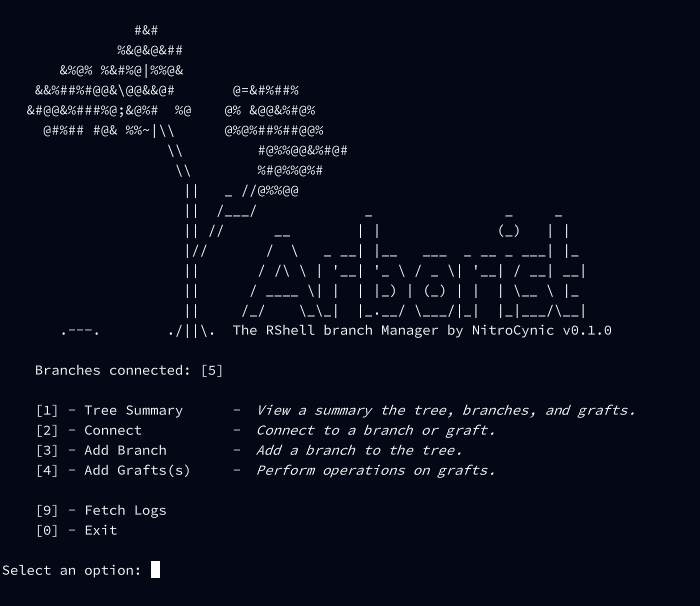
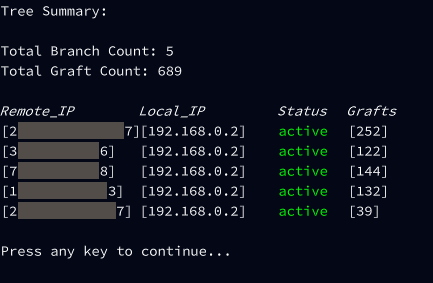
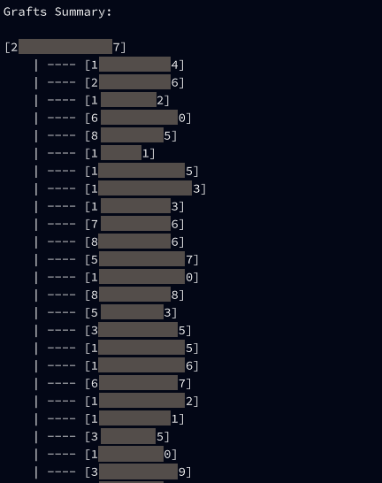

# Arborist

**Arborist** is/was the branch-and-graft manager for large-scale rshell orchestration inside *Grey Hack* alongside **[Rootstock](https://github.com/jwfraustro/rootstock)** and **[Scion](https://github.com/jwfraustro/scion)**



## Support Notice

Arborist is provided **as-is**.

I no longer actively play Grey Hack or maintain these projects, and I honestly don't know if this code will even run on the current version of Grey Hack.

This project is released for educational use and as a historical reference for those interested in large-scale network automation in the Grey Hack environment.

## Overview
Arborist provides:
* Automated configuration setup
* A persistent branch database stored on your home machine
* Import and management of rshells created manually or through Scion
* Integration with Rootstock hubs
* A unified interface for interacting with thousands of rshells at scale
* Tools for restoring grafts, pruning obsolete connections, fetching new grafts, and executing scripts across all branches
* Connect and launch a terminal on any graft, on any Rootstock hub, on-demand

```
Scion    Scion    Scion   Scion <--- reverse-shells
    \    /          \     /
   Rootstock        Rootstock   <--- Rootstock Hubs
       \__\          _/_/
          \\        //
           \\      //
            Arborist             <--- RShell Manager
              |:|
           ../|:|\.-.
```

### Check out the other parts of the Arborist Suite:
* [Rootstock](https://github.com/jwfraustro/rootstock) - An automated hub-deployment layer for creating reverse-shell hubs
* [Scion](https://github.com/jwfraustro/scion) - A self-elevating reverse-shell grafting tool

## Arborist?
In horticulture, an **arborist** is a professional who cultivates and manages trees.

Together with rootstock (the part of the plant that provides the root system) and scion (the cutting that is grafted onto the rootstock), you can see the theme.

> Fun fact: Arborist was responsible for monitoring and fetching the logs of over 5,000 compromised hosts as part of the (now defunct) Grey Hack Map project and was stress-tested to manage over 10,000 simultaneous rshell connections in a single session.

## Features

### Rootstock Integration

Connected to Rootstock hubs, Arborist can:

* pull grafts from Rootstock hubs
* push commands to Rootstock for remote execution
* retrieve graft shells automatically via the hub’s `get_grafts` executable
* launch terminals on any graft on any hub



### Scion Integration

With Scion, Arborist can:

* automatically repair failed grafts
* re-elevate lost shells
* deploy new grafts as needed

### Graft Management (from `branch.src`)

Each branch wraps a live rshell and metadata for every graft, including:

* IP address
* attached hub
* rshell connection



### Tree Operations

Arborist by default includes commands to:

* List all branches
* Execute commands across all shells
* Prune unreachable or dead branches
* Lift and shift grafts between hubs
* Restore grafts
* Check hub status
* Re-sync with Rootstock

And a custom command used as part of the Grey Hack Map project:
* Check the logs of every graft and retrieve them if new traffic is detected

## Installation

It is highly recommended to clone this repository and use either:

* the **[Greybel CLI](https://github.com/ayecue/greybel-js)**, or
* the **[Greybel VSCode extension](https://github.com/ayecue/greybel-vs)**

to compile the Arborist source and its dependencies.

### Clone with dependencies

Arborist uses the following submodules:

* **gh-corelib**
* **scion**
* **rootstock**
* **chainsaw**

Clone with:

```bash
git clone --recurse-submodules https://github.com/jwfraustro/arborist
```

> **Cloning without submodules or attempting to manually copy the files into Grey Hack and compile is strongly discouraged.**

## Usage

Arborist is intended to be run as a standalone executable but can also be imported as a module into other Grey Hack scripts.

When Arborist runs for the first time:

* it checks for `/etc/arborist/`
* if missing, it offers to create the directory and config file
* if running without root, setup will fail (and Arborist will exit)

Arborist stores serialized branch objects in:

```
/etc/arborist/.arborist_data
```

Branches can be added to Arborist by specifying the Rootstock hub IP addresses and passwords in this file. A running SSH service on the hub is required.

## On Complexity

Arborist is by far the most complex part of the Arborist Suite.
It is intended for Grey Hack users who want to manage large, automated networks of reverse shells without micromanagement and are comfortable with scripting.

The tool is capable of handling hundreds or thousands of shells, but doing so requires understanding how Rootstock and Scion interoperate.

## License

This project is licensed under the MIT License. See the [LICENSE](LICENSE) file for details.
